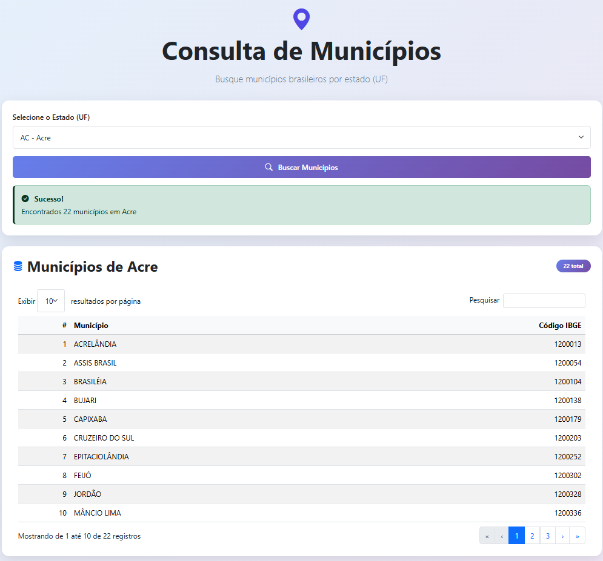

<h1 align="center">
   🌎 API de Municípios
</h1>

<p align="center">
  
</p>

API RESTful desenvolvida em Laravel para consulta de municípios brasileiros por UF, com suporte a múltiplos providers (BrasilAPI e IBGE), cache e fallback automático.

---

## 🏗️ Instalação

1. **Clone o repositório:**
   ```bash
   git clone https://github.com/lucasbars/desafio-api.git
   cd desafio-api
   ```

2. **Instale as dependências:**
   ```bash
   composer install
   ```

3. **Defina o provider desejado no arquivo `.env`:**
   ```bash
   MUNICIPIOS_PROVIDER=brasilapi
   ```
   > Alternativas possíveis: `brasilapi` (padrão) ou `ibge`.

4. **Inicie o servidor de desenvolvimento:**
   ```bash
   php artisan serve
   npm run dev
   ```

---

## 🚀 Uso da API

**Endpoint:**  
`GET /api/municipios/{UF}`

**Exemplo:**  
```bash
http://127.0.0.1:8000/api/municipios/CE
```

**Resposta de sucesso (200):**
```json
[
  {
    "name": "Fortaleza",
    "ibge_code": "2304400"
  },
  ...
]
```

**Resposta de erro (500):**
```json
{
  "error": "Não foi possível buscar os municípios. Tente novamente mais tarde.",
  "details": "Falha no provider App\Services\BrasilApiProvider"
}
```

---

## 💾 Cache

A resposta de cada UF é armazenada em cache por **24 horas** para reduzir chamadas externas.

```php
return Cache::remember($cacheKey, 60 * 60 * 24, function () use ($uf) {
    return $this->provider->getMunicipios($uf);
});
```

> O cache é automaticamente limpo nos testes para evitar resultados inconsistentes.

---

## 🧪 Testes

### Executar todos os testes:
```bash
php artisan test
```

### Tipos de testes incluídos:
- **Unitários:** verificam a resposta dos providers reais (BrasilAPI e IBGE).  
- **De Integração:** validam o endpoint completo `/api/municipios/{UF}`.

Exemplo de sucesso:
```
PASS  Tests\Feature\MunicipioApiTest
✓ api municipios real
✓ api municipios inexistente
```

---

## ⚙️ Estrutura resumida

```
app/
 ├── Http/
 │   └── Controllers/
 │       └── MunicipioController.php
 ├── Services/
 │   ├── MunicipioService.php
 │   ├── BrasilApiProvider.php
 │   ├── IbgeProvider.php
 │   └── MunicipioProviderInterface.php
 └── Exceptions/
     └── ProviderException.php

resources/
 ├── css/
 │   └── index.css
 ├── js/
 │   └── index.js
 └── views/
     └── index.blade.php

tests/
 ├── Feature/
 │   └── MunicipioApiTest.php
 └── Unit/
     └── MunicipioProviderTest.php


```

---

## 🧩 Tecnologias

- **PHP 8.1.4+**
- **Laravel 10.49.1**
- **Cache nativo (via `Illuminate\Support\Facades\Cache`)**
- **Testes com PHPUnit**

---

## 📚 Licença

Este projeto é open-source sob a licença [MIT](LICENSE.md).

---
